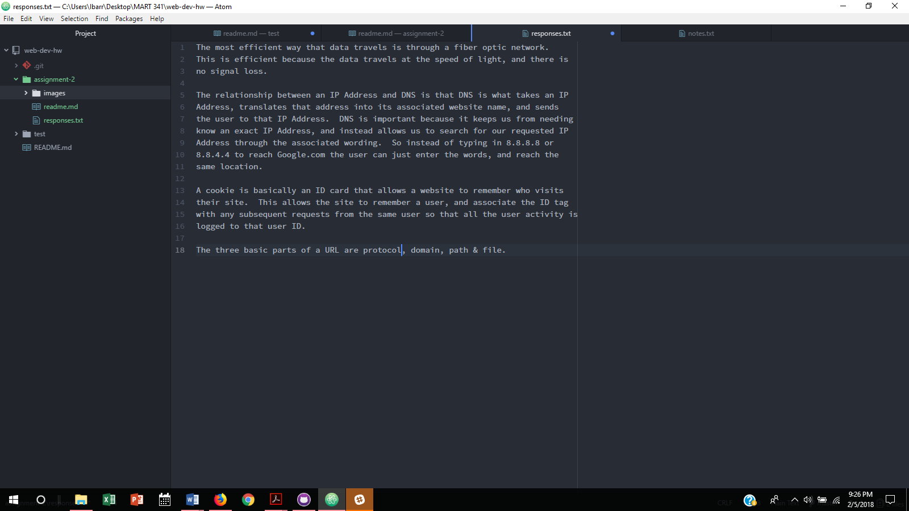

# Assignment 2

A version control system is what allows developers to edit files, and track their changes over time, without running the risk of messing something up & losing their whole site.  It allows the developer to create a list of changes they made to their files, and if something gets messed up all they have to do is revert to a previous version to get their files working again.  This makes collaboration, and managing conflicts, much easier.

My [responses](./responses.txt)

In this work cycle I learned how to link separate files using both relative and absolute URL's, learned how to use Git's version control system, how to create a repository, and how to push my saved work to my GitHub repository.
I also didn't really have any problems or issues during this assignment.
There isn't really anything I learned that I would like to discuss further since most of what I learned is just going to take practice to understand, and learn the material from this week's lessons.
Finally, I didn't post any problems to the repository, and didn't help any classmates with any.

My 
