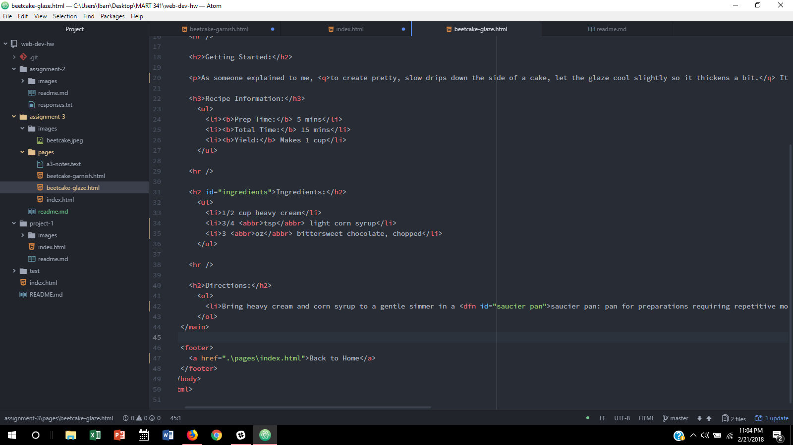

# Assignment 3

You can have one head and one boyd element per page along with their respective ending tags.  The head element contains information about the page, and usually includes the title element.  While the body element determines what text is shown inside the browser window.

Structral markup uses elements to describe the headings, paragraphs, etc. of a page.  While semantic markup provides additional information for the page content by placing emphasis, quotes, acronymns, etc on the words/sentences.

In this work cycle I learned how to semantically markup webpages, link both internal & external sites, and nest lists.
I didn't encounter any problems or issues during this assignment.
I would love to learn who actually enjoys eating beet cake with its decorations, and how it became popular enough for Martha Stewart's attention.
Finally, I didn't post any problems to the repository, and didn't help any classmates with any.

My 
