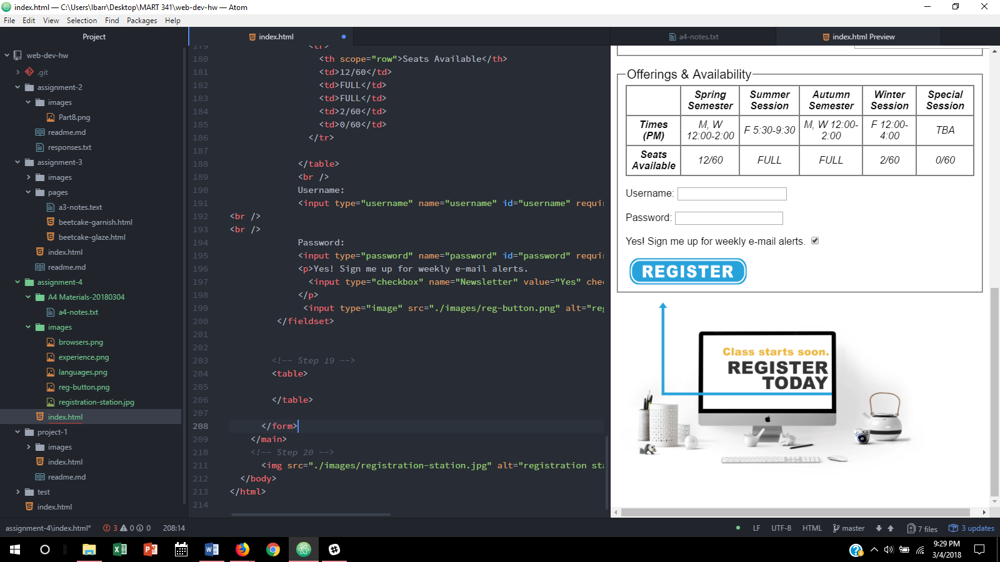

# Assignment 4

Alt text is a word or phrase that can be used as an attribute in any HTML document to tell a user the image contents.  It appears where the image would normally appear.  We use it for broken links, and disabled users.

I've seen alt text used to add context to an image, and to describe an image link that was broken mostly.
Again they serve the purpose of informing the users, and disabled users.

My workcycle this week was pretty hectic since I have also been preparing to travel to Japan the next nine days.  I basically just worked my way through the assignment troubleshooting as needed.

My Progress 
