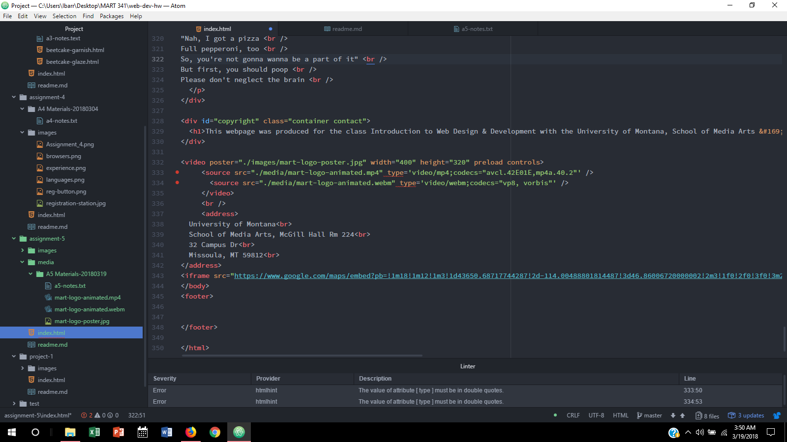

# Assignment 5

The div element is similar to building blocks in that they are used by developers to increase strucural clarity, identify element groups, and increase readability.  Classes serve a similar function but are used as an identifier for HTML elements, and can group similar types together using the same name value making styling multiple elements simplier.  ID attributes  are simlar to the class attribute in that they are used for identification, but each ID must possess a unique value.  Finally a span element is used within the div element, contains a class or ID attribute, and is used to identify text that needs to appear uniquely on the HTML page.

You would consider third party media because it makes uploading high-quality versions of media easy, and the site will handle making the media compatible, encoded, and other necessary details so the media is playable on all varieties of browsers.  Not to mention it is often cheaper to use third-party hosting over self hosting.

Similar to previous assignments I went through every step of the weekly course material to complete the assignment, and revisited pages as needed.  Once the assignment was completed I uploaded the assignment, and checked for any errors or inconsistencies.  If any were made I corrected them, and resubmitted until the assignment appeared as desired.  This assignment was easier than previous assignments since I had previously linked media for other web development projects.

My Progress 
