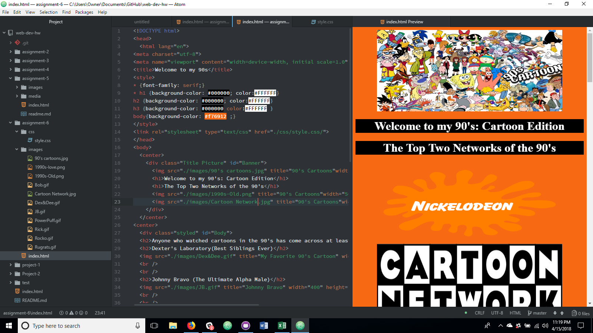

# Assignment 6

For me the 90's has always been defined by the cartoons and video games I experienced as a child.  So when it came to choosing a theme it was easy.  The graphic I chose that i altered a bit was the Nickelodeon orange "Splat".  90's websites were definitely more blocky in design to showcase as much of the new materials as possible in the smallest amount of space.  My website takes the blocky design of the past, but then also stretches it out a bit so that each cartoon can be appreciated individually as the viewer relives their memories of each cartoon.

The three colors I chose were white, black, and orange (hex codes #FFFFFF, #000000, #F76912) which were heavily associated with cartoons during the 90's because of Nickelodeon's and Cartoon Network's domination of the industry.

My work cycle for this assigment was to look at the assignment requirements, view the assignment example, and view other student's work for inspiration for this assignment.  I have been out of town to Denver & Seattle this last week for recruitment trips with companies offering full time employment after graduation so I haven't been able to spend a lot of time on this assignment.  Once getting some inspiration I went on to complete the assignment, and create a sort of tribute page to 90's cartoons with a look at current cartoons that are caring on their tradition of greatness.

My Progress 
