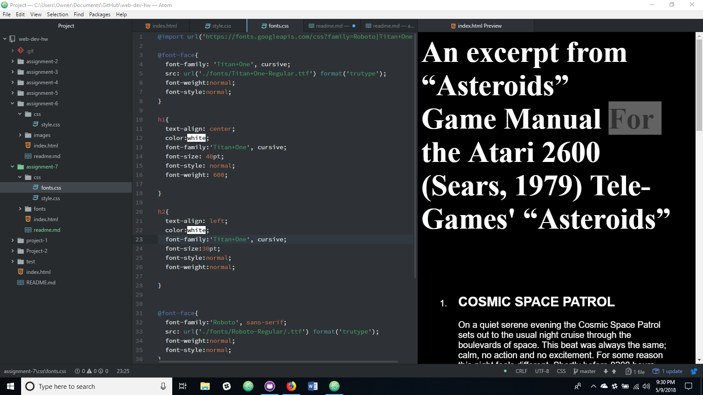

# Assignment 7

For this assignment my design process was to research the original game font for Asteroids, and then I tried to find fonts that would bring the game into the new age.  The two fonts that I chose was Titan One & Roboto because they fit each other well, and had a game manual text kind of feel to the font types.

System fonts are the fonts already pre-installed on a computer.  Web fonts are custom fonts hosted on a server. Finally, web-safe fonts are fonts developers can use on the system that will be available on both PC and Mac devices.  Thus making them fonts safe for web development.  The reason font stacks are important is because it provides back up fonts for a website to try to present should the first font choice fail.  This will allow a website to still render even if the first font choice fails to render properly.

I have been extremely busy with my final classes before graduation so my work process consisted of sitting down and doing this whole assignment in one sitting.

My Progress 
