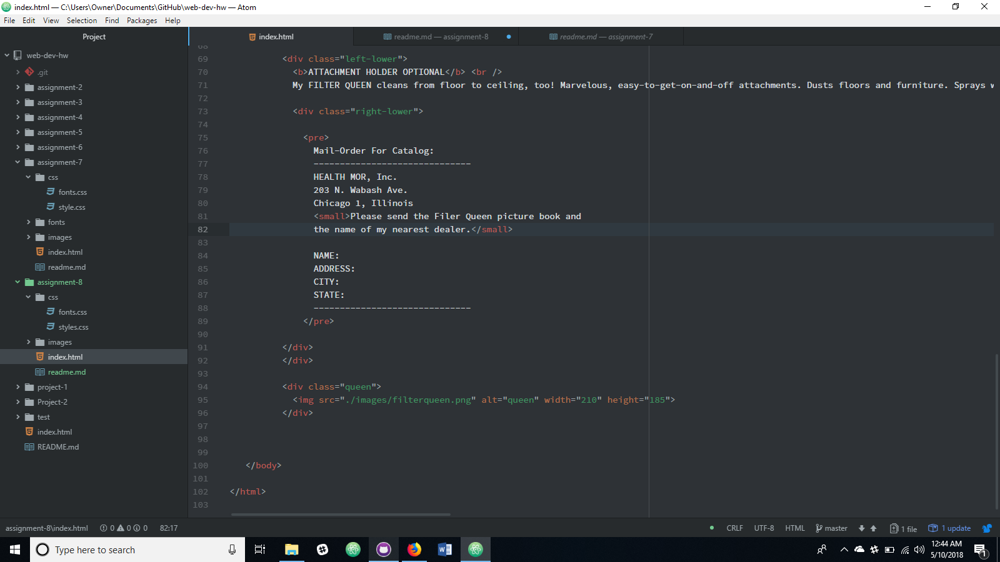

# Assignment 8

Padding is the space created between the border area of the content, and the actual content.  The border is the space created around the content.  As default it is set to 0, but can be made thicker, and more visible.  Finally the margin is the entire space available for web content.  It sets the boundaries of the webpage, and the area web content can be on.

I wasn't able to get the spacing correct so that was the hardest part.  I thought I had it figured out, but it just wouldn't cooperate.  I am sure with more time I could figure it out, but with this assignment being due two days before I expected I ran out of time.

I worked through this assignment as best as possible all at once.  I planned on completing this assignment tomorrow, but when I received the email that it was due tonight I had to work all at once.

My Progress 
